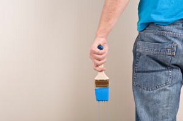
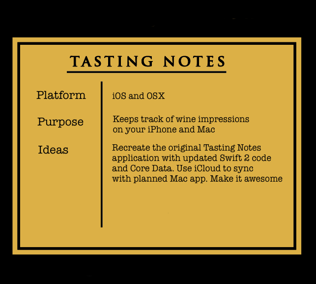
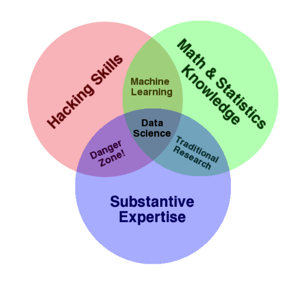

[Designing Tasting Notes](designing-tasting-notes/)

This week I put some thought into how Tasting Notes
should look and feel. I'm tempted to keep the app
exactly the same as before, but just upgraded for
Swift and the other tools in the latest version of
Xcode.

[But, here's the thing...](designing-tasting-notes/)

[How to Make an iPhone App](how-to-make-an-iphone-app/)

Early this week, I thought I would sit down and bang out
a revised version of my iPhone App Tasting Notes. LOL. 
This turned out to be a lot harder than expected.

In an ironic twist of fate, I'm now googling the same
keywords that I used to own to try and figure out how to
build my app.

[Check it out](how-to-make-an-iphone-app/)

[Tasting Notes 4 Kickoff](tasting-notes-4-developer-kickoff/)

Now that I decided that I do want my app back on the 
App Store, I have to figure how to get this done. And 
I want to explore some of the implementation possibilities.
Just how much of a reboot is this going to be?

[Find out more...](tasting-notes-4-developer-kickoff/)

[Been Knocked Down Hard, But ...](guys-im-debating-a-reboot/)

I wanted to write about getting back into iPhone development,
but I ended up talking about the harsh reality of achieving
your dreams only to have them evaporate right before your eyes.

[I touch on the some of the darker elements](guys-im-debating-a-reboot/) of the so-called
Lifestyle Business world. You may know these types of businesses as Internet
Business or Online Business. I'm also sharing my plans on how to recover
the best parts of my online business from the depths that I sank it to.

[Coursera Data Science Certificate](data-science-certificate-program/)

It's been 6 years since I left my career. Since then, it has been renamed to 
*Data Science* and has received a serious makeover. So I've decided to take
an online certification course in this. Stay tuned for my notes and 
thoughts about the class and more.

[Find out more...](data-science-certificate-program/)

[Why I'm Writing My Own Blogging Engine](why-i-am-building-my-own-blog-engine/)

Against the advice of almost everyone online business guru out there, I'm building my own blogging engine.  [Here's why...](why-i-am-building-my-own-blog-engine/)

  

[Swift Extensions](Swift-Extensions/)
  
You use extensions when you want to add methods and computed properties to a class, structure or enumeration that already exists.  This comes in handy when you want new behavior for a type, but only in a particular context.  Extensions will remind Objective-C programmers of categories.  [MORE](Swift-Extensions/)

  
[More Code Please](more-code-please/)
  
I work on a computer that has many, many apps and frameworks and plug-ins that pump and bang
and grind all night and day. It is a miracle that I can email or Tweat or talk on Skype or 
that my clients will visit me here. There is so much code. Every few minutes my monitor blacks 
out or the PC fan starts spinning like a meat grinder. There are too many background processes
running.  [MORE](more-code-please/)

 
  
[The End of an Indie](end-of-an-indie/)
  
Way back on November 25th, 2008 I left my 9-5 job as a Statistical Programmer to see if I could make it as an indie software developer. 

Over the past almost six years I've had some incredible experiences and I've done things I never thought was possible in a million years. 

I've published books, traveled all over the world to teach and ran an indie software business. But, like many things my business has reached the end of it's lifecycle.  [MORE](end-of-an-indie/)
