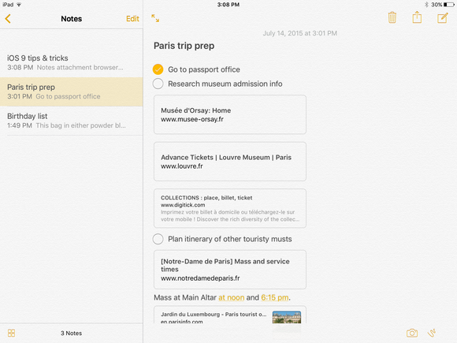

# Designing Tasting Notes

This week I've been grinding away at re-learning iOS development. It's 
been more about learning the newest best practices than literally going
back to what I knew before. A lot has changed since 2008 when I first
learned this stuff.

**Guess what else has changed...**

Apps have also become much more sophisticated. In this past iteration, 
Apple updated the native Notes app and it looks great. Honestly, this
app already does more than Tasting Notes did before I pulled the
app.

[Macworld did a good job of covering the new features in Notes]
(http://www.macworld.com/article/2947866/ios/meet-the-new-notes-ios-9s-feature-packed-evernote-rival.html)
Basically, you could call this app *Uber Notes* because it's
amazing: you can format text, stay in sync with your Mac and
iPad notes, embed maps and photos. You can even **sketch!**

Apps like Evernote, OneNote and Awesome Note have
become [sherlocked](http://www.urbandictionary.com/define.php?term=sherlocked).

*Is Tasting Notes also now sherlocked?*

After all, those apps above were my main competition
over the years.

## What is Different About Tasting Notes?

That being said, Tasting Notes was always a
niche version of Notes. The difference between
Tasting Notes and the other wine apps was that they
all offered a type of structure, different types
of information capture (text, images, lists) and 
the chrome was focused around wine.

Tasting Notes also had search built-in as I'm
sure the others did as well. Search is now built
into most apps now including the native Notes.

### Tasting Notes Features

These are the major features of Tasting 
Notes. I marked the sherlocked features in
red.

- Database like structure
- Wine specific fields
- Searching/Organization
- Note taking
- Customization
-  Online backup (Dropbox)

Basically, I offered a guided experience: users would
input a wine name, take a picture of the wine bottle
label, rate the wine and take a note. This structure is the
main difference between the more generic Notes app.

**Is this enough of a difference?**

*I just don't know...* When I started thinking about
the design of Tasting Notes I wanted to move closer
to a less structured design. Instead of essentially
forcing users to follow a specific workflow I wanted
them to chose what to do for each note. Sometimes they
might quickly snap a picture and rate the wine. Other times
they may only have a name from a menu and so just want
to write down the name and make a note to get a bottle later.

The only problem with this is that I'm essentially removing
all the unique factors of the original app.

I'm coming to the conclusion that Tasting Notes, as
it was before, is not enough.
 

## What is the Minimum Deliverable?

It seems to me that I would have to aim to at least
mimic the relevant features of Notes. So, a nice
note taking UI and iCloud sync. iCloud sync
means that the app should be iPad + iPhone and
eventually Mac. Tasting Notes doesn't need all the
features of Notes though: sketching, maps and
checklists are not relevant.

Once that is in place, then I need some ideas to make
Tasting Notes great.

## Some Ideas

I was quickly brainstorming some ideas.

	Bar code scanning. Tags to replace lists. Wine content 
	integrated right into the note taking UI. Voice notes.
	Attention to the little details. Social features. Data
	Import/Export. Markdown support. Make UI dark theme.

I think that wine content would be a good start. This is work
intensive, but it's something that would really serve to distinquish
Tasting Notes from other Note apps.

### User Interface

I'm thinking of keeping the note screen simple. Users can
basically type whatever they want. There will be a toolbar
that they can use to insert photos, ratings or tags directly 
into the note however they want. Notes will automatically 
be organized into a structure based on tags. Mabye a filtering
system based on tags and ratings. They will be able to put their
notes into any type of folder they wish.

### Losing the Original Customization Model

The original Tasting Notes was actually a database engine
and users could create whatever type of structured app
that they wanted. Most of the appeal was based on the 
limitations of the time. This customization was an answer
to the friction created by the apps of that time.

I'm ditching this model. Customization was a way to
distinquish Tasting Notes from other Wine Note apps.
But, trying to create a general system of notes was complicated.
Users didn't really understand. The UI was clunky. I think removing
the structure entirely is the way to go. Include wine note related
items, but don't try to enforce an artifical structure.

### Tasting Notes == Wine

The original Tasting Notes was meant to be generic. This wasn't
the best experience because the structure felt generic. There was no
place for content. Tasting Notes is going back to the original 
vision of Wine Pad. This is about wine.

# That's All for Now

Yikes, I have work to do. Writing about the app isn't making this
go much quicker and feels overwhelming. Next time folks - I gotta
get back to coding!
